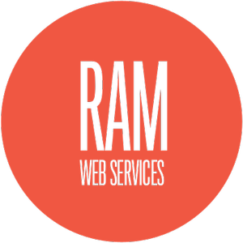

<p align="center">
  
</p>

---

## Requirements

- [Yarn](https://yarnpkg.com/) (needed)

---

## Install RAM Web Services’ front end for local development

> First, get the back end up and running. Follow [these instructions](https://github.com/ram-brands/backend).

Set up the project and fetch all dependencies:

```bash
yarn install
```

Compile and start the application (with hot-reloads):

```bash
yarn serve
```

(Then, to stop the application just type `ctrl-C`.)

---

## Wanna write some code? Follow these steps first

Format your code:

```bash
yarn lint
```

Check if the production build is working:

```bash
yarn build --mode development
```

---

## Customize configuration

See [Configuration Reference](https://cli.vuejs.org/config/).
